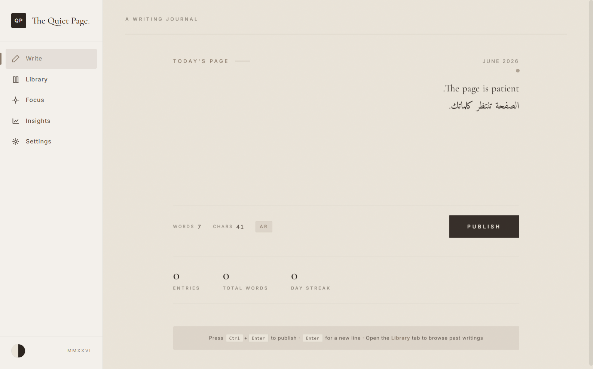

# The Quiet Page

A calm, private desktop writing space for Arabic and English.

The Quiet Page stores entries, settings, and unfinished drafts on your own
computer. It has no accounts, analytics, advertising, or online service.



## Download

Open the repository's **Releases** page and choose one of:

- `The-Quiet-Page-1.1.0-Setup.exe` — normal Windows installer
- `The-Quiet-Page-1.1.0-Portable.exe` — portable version with no installation

Windows may show a SmartScreen warning because the community build is not
code-signed. Verify the SHA-256 checksums published with each release.

## Features

- Arabic right-to-left and English left-to-right writing
- Local journal library with search, editing, pinning, import, and export
- Focus mode, writing statistics, themes, typography, and typewriter sounds
- Offline fonts and no network requests
- JSON and plain-text backups

## Where data is stored

On Windows, journal data is stored under:

```text
%APPDATA%\The Quiet Page
```

Uninstalling the app does not delete your writing. Back up entries from
**Settings → Export All as JSON**.

See [PRIVACY.md](PRIVACY.md) for the full privacy summary.

## Development

Requirements: Node.js 22 or newer.

```powershell
npm install
npm start
```

Create the Windows installer and portable executable:

```powershell
npm run dist
```

Artifacts are written to `release/`.

## License

The application source is released under the [MIT License](LICENSE). Bundled
fonts have their own SIL Open Font License files under `licenses/fonts/`.
